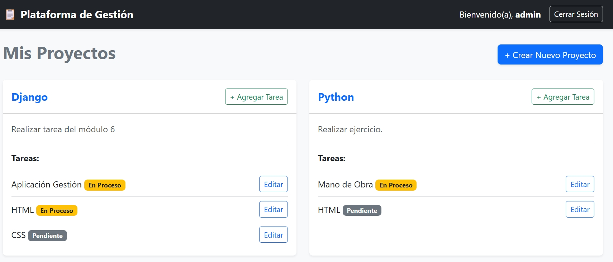
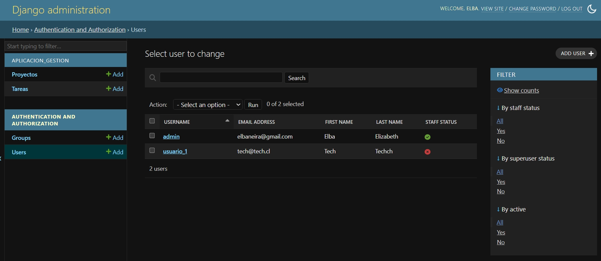
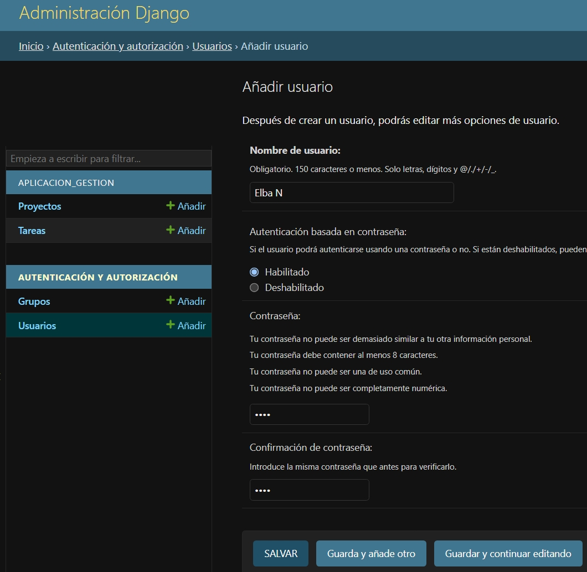
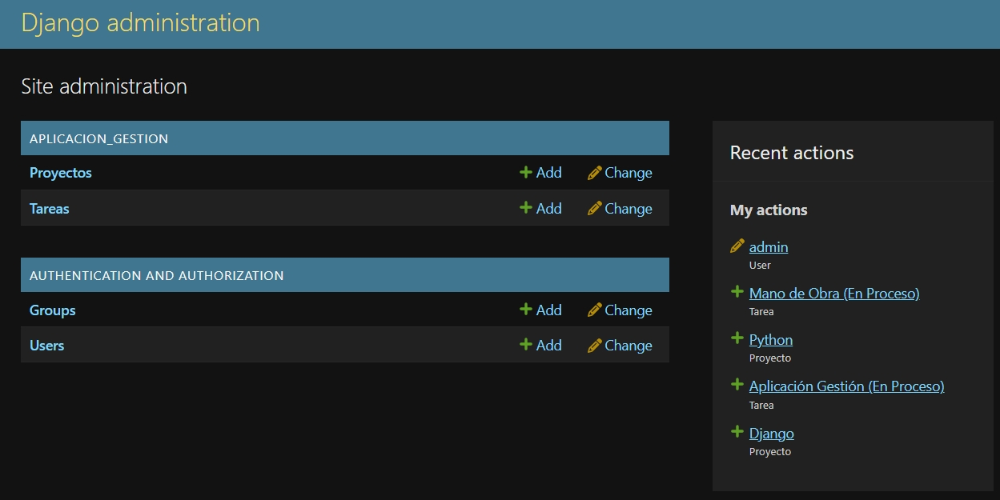
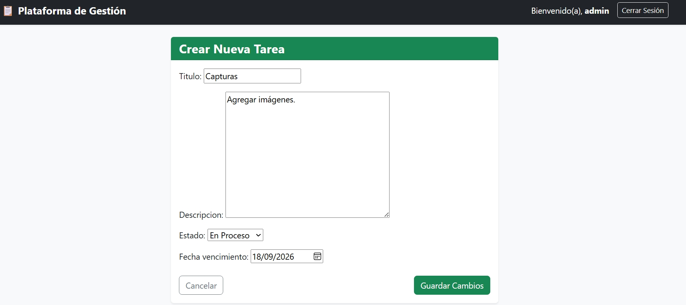
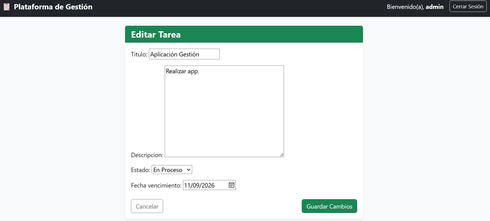

# 🌐 Django Web App

> Aplicación web desarrollada con **Python y Django** como parte de mi proceso de aprendizaje en desarrollo web.


---

## 📌 Sobre el proyecto

Este proyecto representa una de mis primeras experiencias desarrollando una aplicación web utilizando **Django**.

El objetivo fue comprender cómo funciona la estructura de una aplicación Django y cómo se conectan sus diferentes componentes para responder a las solicitudes del usuario.

Durante el desarrollo trabajé principalmente con:

- URLs
- Vistas
- Plantillas HTML
- Formularios
- Solicitudes HTTP
- Datos
- SQLite

Más que completar una aplicación, este proyecto fue una oportunidad para comenzar a comprender **cómo piensa y se estructura un framework web**.

---

## 🧩 ¿Qué aprendí?

Uno de los principales aprendizajes fue entender el recorrido que realiza una solicitud dentro de Django:

```text
Usuario
   │
   ▼
URL
   │
   ▼
Vista
   │
   ▼
Procesamiento de datos
   │
   ▼
Plantilla HTML
   │
   ▼
Respuesta al usuario

Este flujo me permitió conectar conocimientos que ya había adquirido previamente en Python con el desarrollo de aplicaciones web.

🛠️ Tecnologías utilizadas
| Tecnología           |  Uso                                |
| ----------------------- | -------------------------------- |
| 🐍 **Python**         | Lenguaje principal                 |
| 🌐 **Django**         | Framework para desarrollo web      |
| 📝 **HTML5**          | Estructura de las páginas          |
| 🗄️ **SQLite**         | Base de datos                      |
| 🔧 **Git**            | Control de versiones               |
| 🐙 **GitHub**         | Gestión y publicación del proyecto |
| 💻 **Visual Studio Code** | Entorno de desarrollo          |

---
📂 Estructura del proyecto
DjangoWebApp-/
│
├── aplicacion_gestion/
│   ├── migrations/
│   ├── templates/
│   ├── admin.py
│   ├── apps.py
│   ├── models.py
│   ├── tests.py
│   ├── urls.py
│   └── views.py
│
├── gestion_proyectos/
│   ├── settings.py
│   ├── urls.py
│   ├── asgi.py
│   └── wsgi.py
│
├── db.sqlite3
├── manage.py
└── README.md
---

⚙️ Instalación y ejecución
1. Clonar el repositorio
git clone https://github.com/elbaneira/DjangoWebApp-.git

2. Ingresar al proyecto
cd DjangoWebApp-

3. Crear un entorno virtual
python -m venv venv

4. Activar el entorno virtual
En Windows:
venv\Scripts\activate

5. Instalar Django
pip install django

6. Ejecutar las migraciones
python manage.py migrate

7. Iniciar el servidor
python manage.py runserver

Luego acceder desde el navegador:
http://127.0.0.1:8000/

---
📸 Vista previa 
🏠 Página principal 
### Panel principal

La aplicación cuenta con un panel principal desde el cual es posible visualizar los proyectos, sus tareas y el estado de avance de cada una.








📋 Listado o gestión de proyectos 

➕ Formulario para crear/agregar información 

🔎 Alguna vista importante de la aplicación 

---
🎯 Objetivos de aprendizaje

Con este proyecto busqué:

Comprender la estructura básica de Django.
Crear y configurar una aplicación.
Trabajar con rutas y vistas.
Conectar URLs con funciones de Python.
Utilizar plantillas HTML.
Procesar información enviada mediante formularios.
Comprender el funcionamiento de las solicitudes GET y POST.
Introducirme en el trabajo con bases de datos dentro de Django.
Utilizar Git y GitHub como parte del flujo de desarrollo.

---
💡 Lo que sigue

Este proyecto es parte de un proceso de aprendizaje continuo.

Los siguientes pasos están orientados a profundizar en:

🗄️ Modelos y ORM de Django
🔄 Operaciones CRUD
📋 Formularios
🔐 Autenticación y usuarios
🧮 Consultas a bases de datos
🎨 Mejoras de interfaz
🚀 Desarrollo de proyectos propios
📚 Reflexión

---
Aprender Django significó dar un paso desde programas ejecutados directamente en Python hacia aplicaciones que interactúan con usuarios y gestionan información.

Este proyecto me ayudó especialmente a comprender que aprender un framework no consiste solamente en memorizar comandos, sino en entender cómo se relacionan sus diferentes componentes.

---
Cada proyecto es una nueva oportunidad para transformar lo aprendido en algo propio.

---

👩‍💻 Autora
Elba Neira
---

Proyecto desarrollado como parte de mi proceso de formación en programación, desarrollo web y análisis de datos.

📌 Ver repositorio en GitHub

⭐ Un proyecto más en el camino de convertir el aprendizaje en proyectos reales.
